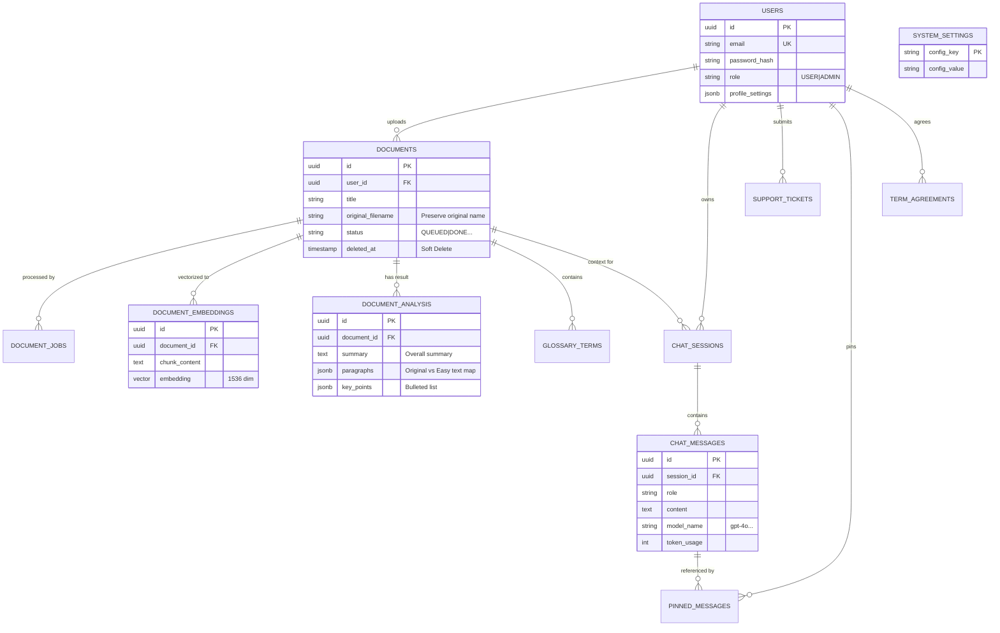

# Database Schema Design

이 문서는 `DocAssist` 프로젝트의 프론트엔드 기능 분석을 바탕으로 설계된 데이터베이스 스키마 명세서입니다.
**PostgreSQL**을 기준으로 작성되었으며, 프론트엔드의 모든 기능(Q&A, 드라이브, 관리자, 설정 등)과 **AI(GPT/RAG)** 기능을 완벽히 지원하도록 설계되었습니다.

## 1. ER Diagram (Entity Relationship)



---

## 2. Tables Overview

### 👤 Core Domain (User & Document)
| Table Name | Description | Related Page |
|---|---|---|
| **`users`** | 사용자 기본 정보, 역할, 프로필 설정(JSON) 저장 | `Signup`, `Profile`, `Admin` |
| **`documents`** | 업로드된 문서 정보, 파일 경로, 상태, 원본 파일명 | `Drive`, `Upload`, `Admin` |
| **`document_jobs`** | 문서 분석(OCR, 임베딩) 작업 상태, 결과 데이터, 로그 | `Admin` (Dashboard) |
| **`document_analysis`** | **(New)** 문서 분석 결과 (요약, 문단별 쉬운 말/원문 매핑) | `DocComparePage` |

### 🤖 AI & RAG Domain
| Table Name | Description | Related Page |
|---|---|---|
| **`document_embeddings`** | 문서 텍스트 청크 및 벡터 임베딩 저장 (`pgvector`) | `Upload` (Processing), `QaPage` |
| **`glossary_terms`** | 문서에서 추출된 전문 용어 및 설명 | `Sidebar`, `Profile`, `DocCompare` |

### 💬 Q&A & Knowledge Domain
| Table Name | Description | Related Page |
|---|---|---|
| **`chat_sessions`** | 사용자-AI 간의 대화 세션 (문서 컨텍스트 포함) | `QaPage` |
| **`chat_messages`** | 메시지 내용, AI 모델명, **토큰 사용량**, 답변 근거 | `QaPage`, `DocCompare` |
| **`pinned_messages`** | 사용자가 중요 표시(Pin)한 메시지 보관 | `QaPage` |

### 🛡️ Admin & System Domain
| Table Name | Description | Related Page |
|---|---|---|
| **`support_tickets`** | 사용자 문의 및 신고 사항 관리 | `Admin` (Tickets) |
| **`access_policies`** | 시스템 접근 제어 및 보안 정책 관리 | `Admin` (Access) |
| **`system_settings`** | 전역 설정 값 (기본 AI 모델, 워커 수 등) | `Admin` (Settings) |
| **`system_logs`** | 시스템 운영 로그 및 에러 기록 | `Admin` (Logs) |
| **`term_agreements`** | 사용자 약관 동의 이력 (버전 관리) | `Signup` |

---

## 3. DDL Script (PostgreSQL)

아래 스크립트를 실행하면 전체 데이터베이스 스키마가 생성됩니다.
**주의**: `vector` 확장을 사용하므로 PostgreSQL에 `pgvector`가 설치되어 있어야 합니다.

```sql
/* =========================================================
   0. Extensions & Enums
   ========================================================= */
CREATE EXTENSION IF NOT EXISTS "uuid-ossp";
CREATE EXTENSION IF NOT EXISTS vector; -- For RAG embeddings

CREATE TYPE user_role_enum AS ENUM ('USER', 'ADMIN');
CREATE TYPE doc_status_enum AS ENUM ('QUEUED', 'PROCESSING', 'DONE', 'FAILED');
CREATE TYPE job_status_enum AS ENUM ('PENDING', 'RUNNING', 'COMPLETED', 'FAILED');
CREATE TYPE ticket_status_enum AS ENUM ('OPEN', 'IN_PROGRESS', 'RESOLVED');
CREATE TYPE ticket_priority_enum AS ENUM ('LOW', 'MEDIUM', 'HIGH');

/* =========================================================
   1. Users & Auth
   ========================================================= */
CREATE TABLE users (
    id UUID PRIMARY KEY DEFAULT uuid_generate_v4(),
    email VARCHAR(255) NOT NULL UNIQUE,
    password_hash VARCHAR(255) NOT NULL,
    name VARCHAR(100) NOT NULL,
    role user_role_enum DEFAULT 'USER',
    is_active BOOLEAN DEFAULT TRUE,
    -- ProfilePage의 테마, AI 설정(assist level 등)을 JSON으로 유연하게 저장
    profile_settings JSONB DEFAULT '{}'::jsonb,
    last_login_at TIMESTAMP WITH TIME ZONE,
    created_at TIMESTAMP WITH TIME ZONE DEFAULT CURRENT_TIMESTAMP,
    updated_at TIMESTAMP WITH TIME ZONE DEFAULT CURRENT_TIMESTAMP
);

CREATE TABLE password_resets (
    id UUID PRIMARY KEY DEFAULT uuid_generate_v4(),
    email VARCHAR(255) NOT NULL,
    token VARCHAR(255) NOT NULL,
    expires_at TIMESTAMP WITH TIME ZONE NOT NULL,
    created_at TIMESTAMP WITH TIME ZONE DEFAULT CURRENT_TIMESTAMP
);

CREATE TABLE term_agreements (
    id UUID PRIMARY KEY DEFAULT uuid_generate_v4(),
    user_id UUID NOT NULL REFERENCES users(id) ON DELETE CASCADE,
    term_version VARCHAR(20) NOT NULL, -- e.g. 'v1.0'
    agreed_at TIMESTAMP WITH TIME ZONE DEFAULT CURRENT_TIMESTAMP,
    ip_address VARCHAR(45)
);

/* =========================================================
   2. Documents & Jobs
   ========================================================= */
CREATE TABLE documents (
    id UUID PRIMARY KEY DEFAULT uuid_generate_v4(),
    user_id UUID NOT NULL REFERENCES users(id) ON DELETE CASCADE,
    title VARCHAR(255) NOT NULL,
    original_filename VARCHAR(255) NOT NULL, -- 원본 파일명 보존
    s3_key VARCHAR(512) NOT NULL,
    file_type VARCHAR(10), -- 'PDF', 'JPG', 'PNG'
    file_size BIGINT,
    status doc_status_enum DEFAULT 'QUEUED',
    meta_data JSONB DEFAULT '{}'::jsonb, -- page_count, ocr_summary 등
    created_at TIMESTAMP WITH TIME ZONE DEFAULT CURRENT_TIMESTAMP,
    updated_at TIMESTAMP WITH TIME ZONE DEFAULT CURRENT_TIMESTAMP,
    deleted_at TIMESTAMP WITH TIME ZONE -- Soft Delete 지원
);

CREATE TABLE document_jobs (
    id UUID PRIMARY KEY DEFAULT uuid_generate_v4(),
    document_id UUID NOT NULL REFERENCES documents(id) ON DELETE CASCADE,
    status job_status_enum DEFAULT 'PENDING',
    worker_id VARCHAR(100),
    result_data JSONB DEFAULT '{}'::jsonb, -- 작업 상세 결과
    error_message TEXT,
    started_at TIMESTAMP WITH TIME ZONE,
    finished_at TIMESTAMP WITH TIME ZONE,
    created_at TIMESTAMP WITH TIME ZONE DEFAULT CURRENT_TIMESTAMP
);

-- DocComparePage에서 보여줄 구조화된 분석 결과 (요약, 문단 매핑 등)
CREATE TABLE document_analysis (
    id UUID PRIMARY KEY DEFAULT uuid_generate_v4(),
    document_id UUID NOT NULL REFERENCES documents(id) ON DELETE CASCADE,
    summary TEXT, -- 전체 요약
    -- 문단별 데이터: [{ "original": "...", "easy": "...", "bullets": ["..."] }, ...]
    paragraphs JSONB DEFAULT '[]'::jsonb, 
    -- 문서 전체의 핵심 규칙/포인트: [{ "title": "...", "desc": "...", "source": "..." }]
    rules JSONB DEFAULT '[]'::jsonb,
    created_at TIMESTAMP WITH TIME ZONE DEFAULT CURRENT_TIMESTAMP,
    UNIQUE(document_id) -- 문서당 하나의 분석 결과만 존재
);

/* =========================================================
   3. Knowledge & AI (Glossary, Embeddings)
   ========================================================= */
CREATE TABLE glossary_terms (
    id UUID PRIMARY KEY DEFAULT uuid_generate_v4(),
    document_id UUID REFERENCES documents(id) ON DELETE CASCADE,
    term VARCHAR(100) NOT NULL,
    definition TEXT NOT NULL,
    tags VARCHAR(50)[],
    complexity_level INT DEFAULT 1, -- 1~5
    created_at TIMESTAMP WITH TIME ZONE DEFAULT CURRENT_TIMESTAMP
);

-- RAG를 위한 벡터 임베딩 테이블
CREATE TABLE document_embeddings (
    id UUID PRIMARY KEY DEFAULT uuid_generate_v4(),
    document_id UUID NOT NULL REFERENCES documents(id) ON DELETE CASCADE,
    chunk_index INT NOT NULL,      -- 문서 내 순서
    chunk_content TEXT NOT NULL,   -- 실제 텍스트 조각
    embedding VECTOR(1536),        -- OpenAI Ada-002/Small-3 기준 (차원수 조정 가능)
    created_at TIMESTAMP WITH TIME ZONE DEFAULT CURRENT_TIMESTAMP
);

/* =========================================================
   4. Q&A (Chat)
   ========================================================= */
CREATE TABLE chat_sessions (
    id UUID PRIMARY KEY DEFAULT uuid_generate_v4(),
    user_id UUID NOT NULL REFERENCES users(id) ON DELETE CASCADE,
    document_id UUID REFERENCES documents(id) ON DELETE SET NULL,
    title VARCHAR(255),
    created_at TIMESTAMP WITH TIME ZONE DEFAULT CURRENT_TIMESTAMP,
    updated_at TIMESTAMP WITH TIME ZONE DEFAULT CURRENT_TIMESTAMP
);

CREATE TABLE chat_messages (
    id UUID PRIMARY KEY DEFAULT uuid_generate_v4(),
    session_id UUID NOT NULL REFERENCES chat_sessions(id) ON DELETE CASCADE,
    role VARCHAR(20) NOT NULL CHECK (role IN ('user', 'assistant', 'system')),
    content TEXT NOT NULL,
    -- 답변 근거: [{section, page, score, quote}]
    citations JSONB DEFAULT '[]'::jsonb,
    -- AI 모델 및 토큰 사용량 추적
    model_name VARCHAR(50),      -- e.g. 'gpt-4o'
    prompt_tokens INT DEFAULT 0,
    completion_tokens INT DEFAULT 0,
    created_at TIMESTAMP WITH TIME ZONE DEFAULT CURRENT_TIMESTAMP
);

CREATE TABLE pinned_messages (
    id UUID PRIMARY KEY DEFAULT uuid_generate_v4(),
    user_id UUID NOT NULL REFERENCES users(id) ON DELETE CASCADE,
    message_id UUID NOT NULL REFERENCES chat_messages(id) ON DELETE CASCADE,
    note VARCHAR(255),
    pinned_at TIMESTAMP WITH TIME ZONE DEFAULT CURRENT_TIMESTAMP,
    UNIQUE(user_id, message_id)
);

/* =========================================================
   5. Admin & System
   ========================================================= */
CREATE TABLE support_tickets (
    id UUID PRIMARY KEY DEFAULT uuid_generate_v4(),
    user_id UUID REFERENCES users(id) ON DELETE SET NULL,
    type VARCHAR(50) NOT NULL, -- 'INQUIRY', 'REPORT'
    subject VARCHAR(255) NOT NULL,
    content TEXT NOT NULL,
    status ticket_status_enum DEFAULT 'OPEN',
    priority ticket_priority_enum DEFAULT 'MEDIUM',
    created_at TIMESTAMP WITH TIME ZONE DEFAULT CURRENT_TIMESTAMP,
    resolved_at TIMESTAMP WITH TIME ZONE
);

CREATE TABLE access_policies (
    id UUID PRIMARY KEY DEFAULT uuid_generate_v4(),
    name VARCHAR(100) NOT NULL,
    policy_scope VARCHAR(50) NOT NULL, -- 'Drive', 'API'
    security_level VARCHAR(10) NOT NULL, -- 'L2'
    is_enabled BOOLEAN DEFAULT TRUE,
    description TEXT,
    updated_by UUID REFERENCES users(id),
    updated_at TIMESTAMP WITH TIME ZONE DEFAULT CURRENT_TIMESTAMP
);

CREATE TABLE system_settings (
    config_key VARCHAR(50) PRIMARY KEY,
    config_value TEXT NOT NULL,
    description VARCHAR(255),
    updated_at TIMESTAMP WITH TIME ZONE DEFAULT CURRENT_TIMESTAMP
);

CREATE TABLE system_logs (
    id BIGSERIAL PRIMARY KEY,
    level VARCHAR(20) NOT NULL, -- 'INFO', 'WARN', 'ERROR'
    message TEXT NOT NULL,
    context JSONB,
    created_at TIMESTAMP WITH TIME ZONE DEFAULT CURRENT_TIMESTAMP
);

/* =========================================================
   6. Indexes
   ========================================================= */
CREATE INDEX idx_users_email ON users(email);
CREATE INDEX idx_documents_user_id ON documents(user_id);
CREATE INDEX idx_document_jobs_doc_id ON document_jobs(document_id);
CREATE INDEX idx_glossary_doc_id ON glossary_terms(document_id);
CREATE INDEX idx_chat_sessions_user_id ON chat_sessions(user_id);
CREATE INDEX idx_chat_messages_session_id ON chat_messages(session_id);
CREATE INDEX idx_pinned_messages_user ON pinned_messages(user_id);
CREATE INDEX idx_support_tickets_status ON support_tickets(status);
CREATE INDEX idx_document_analysis_doc_id ON document_analysis(document_id);

-- Vector Similarity Search Index (IVFFlat or HNSW)
-- 데이터가 일정량 쌓인 후 생성 권장, 여기선 스키마 정의용으로 포함
-- CREATE INDEX idx_embeddings_vec ON document_embeddings USING ivfflat (embedding vector_cosine_ops) WITH (lists = 100);
CREATE INDEX idx_embeddings_doc_id ON document_embeddings(document_id);
```
